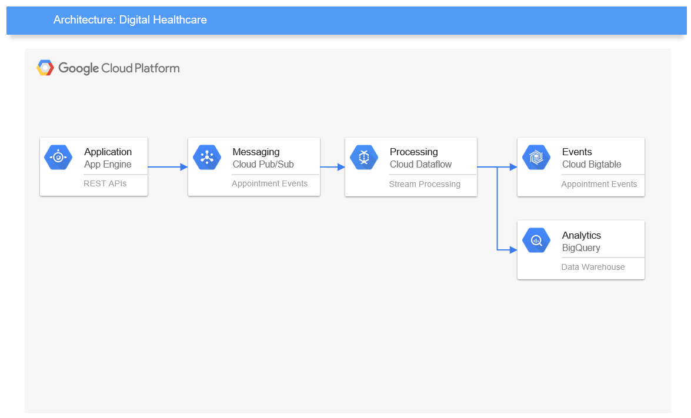

# GCP data ingestion architecture for a Digital Healthcare company

## Table of contents
- [Introduction](#introduction)
- [High Level Design](#high-level-design)
- [Data Ingestion Pipeline](#data-ingestion-pipeline)			
  - [Overview](#overview)
  - [Setup](#setup)
  - [Dataflow Pipeline](#dataflow-pipeline)
- [Analytics](#analytics)
- [Schema Changes](#schema-changes)
- [Reconciliation](#reconciliation)		
- [Error handling](#error-handling)	

## Introduction
Digital healthcare raises hundreds of types of events from microservice based architecture such as from their Mobile Apps. In order to support real time operations as well as requirements for business intelligence, these events must support multiple use cases, but also be able to evolve over time as the microservices themselves to.

The task here is to allow for the ingestion of these events and produce data that is query-able for a number of different views of this data:
- The raw events must be stored in a query-able format
- A view of the current state of an appointment must be shown (Is it currently booked / cancelled or completed) 
- Average duration of appointments should easily be calculable (also by discipline if the information is available).

The solution should be able to:
- Adapt to changes in schema
- Support verification that the end result is correct
- Handle broken events

## High Level Design


## Data Ingestion Pipeline		
  
### Overview
A usual pattern for storage is to store events on BigTable for low latency access and on BigQuery for analytics requirement. 

The second requirement for view is - A view of the current state of an appointment must be shown (Is it currently booked / cancelled or completed).
Assuming the view is not for querying state of a specific appointment, in which case BigTable is more suitable for low latency access, but to present a current state view for all appointments, in which case we will exclude populating Bigtable from this exercise scope, as all three views requirement can be met by BigQuery. 

Dataflow is obvious choice here for ingestion and recommended by Google for processing streaming events and storing on BigQuery and/or Bigtable. 

To keep things simple, we will use Dataflow template here. The template can be customised to meet complex scenarios if required. 

### Setup

#### Create PubSub Topic
```
gcloud pubsub topics create digi_appointments_topic --message-storage-policy-allowed-regions=europe-west2
```
#### Create PubSub Subscription
```
gcloud pubsub subscriptions create digi_appointments_bq_sub --topic=digi_appointments_topic --topic-project=digital-health-uk-poc --ack-deadline=10 
```
#### Create BigQuery Schema
- a schema (dataset:digital_health) is created to store the ingested data
```
bq mk --location=europe-west2 digital_health
```
- a table appointment to store the ingested data  

|Field name	|Type	|Mode|
|-----------|-----|----|
|Type|	STRING|	NULLABLE|	
AppointmentId	|STRING	|NULLABLE|	
|TimestampUtc|	TIMESTAMP|	NULLABLE|	
|Discipline|	STRING|	REPEATED|	

```
bq mk -t digital_health.appointment ./code/digital_health_schema.json
```

- a dead letter table (digital_health.appointment_error_records) for error records is automatically created by Dataflow job, if not created manually before 

|Field name	|Type	|Mode|
|-----------|-----|----|
|timestamp	|TIMESTAMP|	REQUIRED	|
|payloadString	|STRING|	REQUIRED	|
|payloadBytes|	BYTES|	REQUIRED	|
|attributes	|RECORD	|REPEATED	|
|attributes. key	|STRING|	NULLABLE	|
|attributes. value	|STRING|	NULLABLE	|
|errorMessage	|STRING	|NULLABLE	|
|stacktrace	|STRING|	NULLABLE	|

#### Create a storage bucket
```
export BUCKET_NAME=digital_health_uk_poc
gsutil mb -c standard -l europe-west2 gs://$BUCKET_NAME/
```

### Dataflow Pipeline
- A streaming pipeline using PubSub_Subscription_to_BigQuery template is created using gcloud CLI. 
- A transform UDF javascript function is used to flatten "Data" object in the json message.
```
gcloud dataflow jobs run digital-appt-job-1 \
--gcs-location gs://dataflow-templates/latest/PubSub_Subscription_to_BigQuery \
--region=europe-west1 \
--staging-location=gs://digital_health_uk_poc/stage \
--parameters inputSubscription=projects/digital-health-uk-poc/subscriptions/digital_subs,outputTableSpec=digital-health-uk-poc:digital.appointment,javascriptTextTransformGcsPath=gs://digital_health_uk_poc/flattenData.js,javascriptTextTransformFunctionName=transform
```
## Analytics
- A view of the current state of an appointment must be shown (Is it currently booked / cancelled or completed) 
```
SELECT AppointmentId, Type as CurrentStatus
FROM (
SELECT AppointmentId, Type,
       ROW_NUMBER() OVER (PARTITION BY AppointmentId ORDER BY TimestampUtc DESC) AS rnum
FROM `digital-health-uk-poc.digital_health.appointment`)
WHERE rnum = 1
```
|Row	|AppointmentId|	CurrentStatus|	
|-----|-------------|--------------|
|1|	3cb0f939-9398-4d29-a28f-2a1a3a6ce3b2|AppointmentComplete|
|2|	4f3fd16c-4685-45e6-a6f9-823f5f73a7d0|AppointmentComplete|
|3|	757001d9-a454-40d3-a14b-9f0f9440be9f|AppointmentComplete|
|4|	812a8469-68d0-4c9b-8429-d46d51d63db3|AppointmentComplete|
|5|	8825cd95-f172-4132-9793-864b4dd725df|AppointmentCancelled|
|6|	8825cdff-f172-4132-9793-864b4dd72444|AppointmentBooked|
|7|	8825cdff-f172-4132-9793-864b4dd725df|AppointmentBooked|
|8|	a7d86ca5-7541-4c86-a7ad-1bec2b070b3c|AppointmentComplete|


- Average duration of appointments should easily be calculable 
```
SELECT AVG(delta_in_seconds) as Avg_duration_of_appointments
FROM (
SELECT AppointmentId, Type, 
       TIMESTAMP_DIFF(completed_time, booked_time, SECOND) AS delta_in_seconds
FROM (       
SELECT AppointmentId, Type,  
       LAST_VALUE(TimestampUtc) OVER (PARTITION BY AppointmentId ORDER BY TimestampUtc ASC
       ROWS BETWEEN UNBOUNDED PRECEDING AND UNBOUNDED FOLLOWING) AS completed_time,
       FIRST_VALUE(TimestampUtc) OVER (PARTITION BY AppointmentId ORDER BY TimestampUtc ASC
       ROWS BETWEEN UNBOUNDED PRECEDING AND UNBOUNDED FOLLOWING) AS booked_time
FROM `digital-health-uk-poc.digital_health.appointment` 
WHERE Type IN ('AppointmentBooked','AppointmentComplete'))
WHERE Type = 'AppointmentComplete')
```
|Row	|Avg_duration_of_appointments|	
|-----|----------------------------|
|1|	420.0|

- Average duration of appointments by discipline if the information is available 
```
SELECT Discipline, AVG(delta_in_seconds) as Avg_duration_of_appointments
FROM (
SELECT AppointmentId, Type, Discipline,
       TIMESTAMP_DIFF(completed_time, booked_time, SECOND) AS delta_in_seconds
FROM ( 
SELECT AppointmentId, Type, IFNULL(Discipline,'NA') as Discipline,
       LAST_VALUE(TimestampUtc) OVER (PARTITION BY AppointmentId ORDER BY TimestampUtc ASC
       ROWS BETWEEN UNBOUNDED PRECEDING AND UNBOUNDED FOLLOWING) AS completed_time,
       FIRST_VALUE(TimestampUtc) OVER (PARTITION BY AppointmentId ORDER BY TimestampUtc ASC
       ROWS BETWEEN UNBOUNDED PRECEDING AND UNBOUNDED FOLLOWING) AS booked_time
FROM `macro-mender-236621.digital_health.appointment` as appointment
LEFT JOIN UNNEST(appointment.Discipline) AS Discipline
WHERE Type IN ('AppointmentBooked','AppointmentComplete'))
WHERE Type = 'AppointmentComplete')
GROUP BY Discipline
```
|Row	|Discipline|Avg_duration_of_appointments|	
|-----|----------|------------------|
|1|	NA|420.0|
|2|Physio|426.0|

NA - indicates when discipline information is Not Available.

## Schema Changes
Adapt to changes in schema:
- Schema changes can be handled by not flattening "Data" object in Dataflow UDF, but keeping two columns only in BigQuery Appointment table - Type and Data.
- This means future schema changes doesn't affect the ingestion pipeline, but only the SQL view queries has to be modified.

## Reconciliation		
How you verify that the end result is correct?
- Reconciling a streaming data pipeline is a challenge in itself. One possibility is to check cumulative rolling counts. 
- Primarily by monitoring Stackdriver metrics for Topic and Subscription. Some of the important metrics are:
  - subscription/num_undelivered_messages - cumulative rolling count
  - subscription/oldest_unacked_message_age 
  - topic/published requests - cumulative rolling count
- Create alerts that will fire when the metrics values are unusually large in the context of the application.  
- Check BigQuery for messages loaded in a rolling period as well as monitor dead letter table for failures.
- Monitoring above will ensure that all messages added to PubSub topic are ingested by Dataflow and either successfully loaded into table or ends up in dead letter table. 

## Error handling	
What happens if you get a broken event like { "Type": "AppointmentBooked", "Data": { , and how would you handle it?
- Messages can fail to reach the output table for all kind of reasons (e.g., mismatched schema, malformed json). These messages are written to the dead letter table (digital_health.appointment_error_records).
- A sample error record in the dead letter table as below:

|Row|	timestamp|	payloadString|	payloadBytes|	attributes.key|	attributes.value|	errorMessage|	stacktrace|
|---|----------|---------------|--------------|---------------|-----------------|-------------|-----------|
|1|2019-11-27 17:11:17.844 UTC|{ "Type": "AppointmentBooked", "Data": {|eyAiVHlwZSI6ICJBcHBvaW50bWVudEJvb2tlZCIsICJEYXRhIjogew==|||SyntaxError: Invalid JSON: <json>:1:40 Expected , or } but found eof...|javax.script.ScriptException: SyntaxError: Invalid JSON: <json>:1:40 Expected , or } but found eof|
  
- This dead letter table can be analysed for failure type, frequency of errors and possible remediations.
- It is possible to write this information to Cloud Storage or another PubSub Topic as well by customising the Dataflow template.

